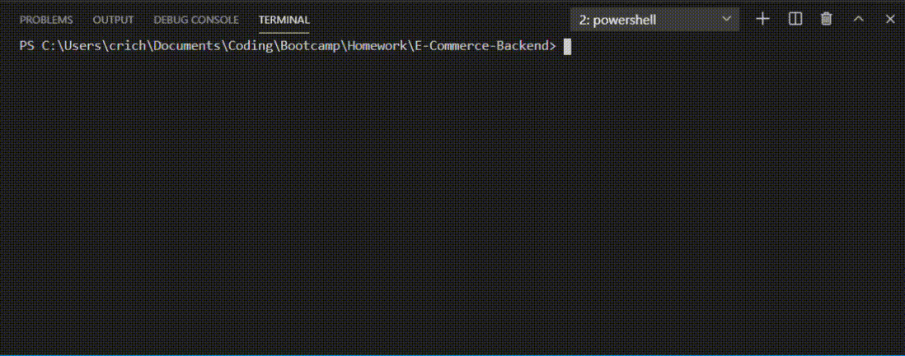

# E-Commerce Backend
    
## Description  
  Provides a simple backend structure for an imaginary e-commerce client. Creates an Express server which connects to a MySQL database via Sequelize. Provides CRUD API endpoints for the products, categories, and tags for the backend data.    

## Usage  
<ol>
<li>Clone the repository and install with npm</li>
<li>Update the a .env.EXAMPLE file with DB_USER and DB_PASSWORD credentials, and rename to ".env"</li>
<li>Create the database by running the db/schema.sql file in MySQL Shell</li>
<li>If desired, seed the database using <i>npm run seed</i></li>
<li>Start the server with <i>npm run start</i></li>
<li>Access and manipulate the data using the provided API endpoints</li>
</ol>

## Demo
Initializing the Server:

[Video Link](./Assets/Demo/Demo_1.mp4)  
 

Using the API endpoints:

[Video Link](./Assets/Demo/Demo_2.mp4)

## Questions  
My GitHub profile: [crichards17](https://github/crichards17)  
My email: [crichards1717@gmail.com](crichards1717@gmail.com)  